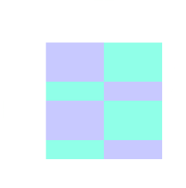
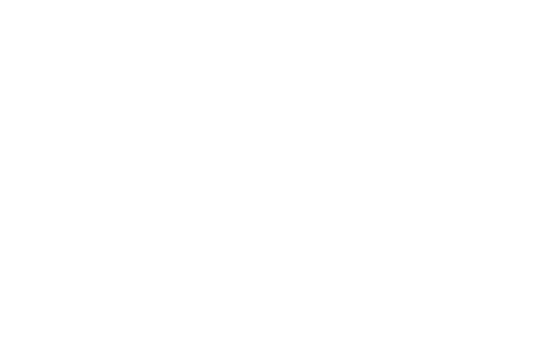
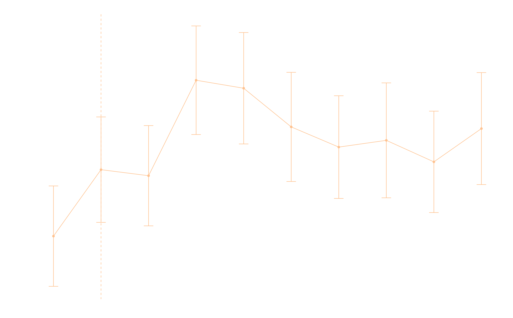
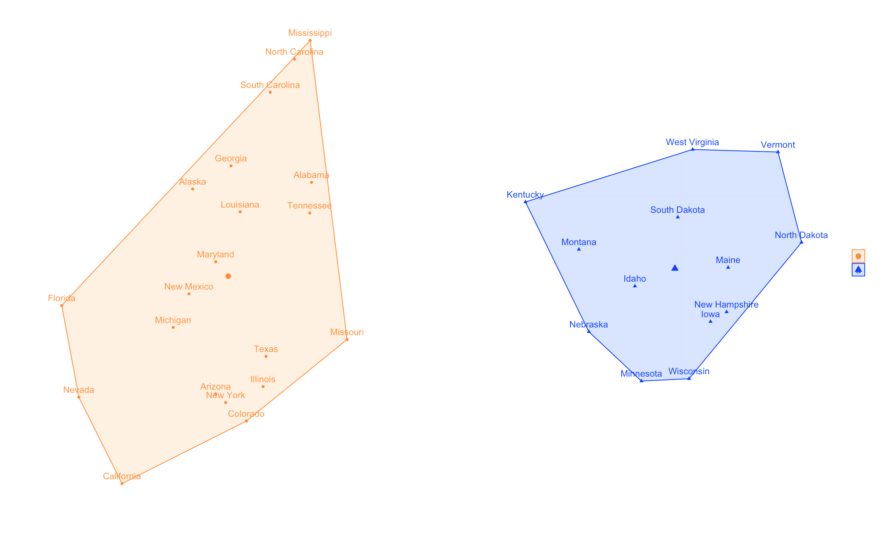
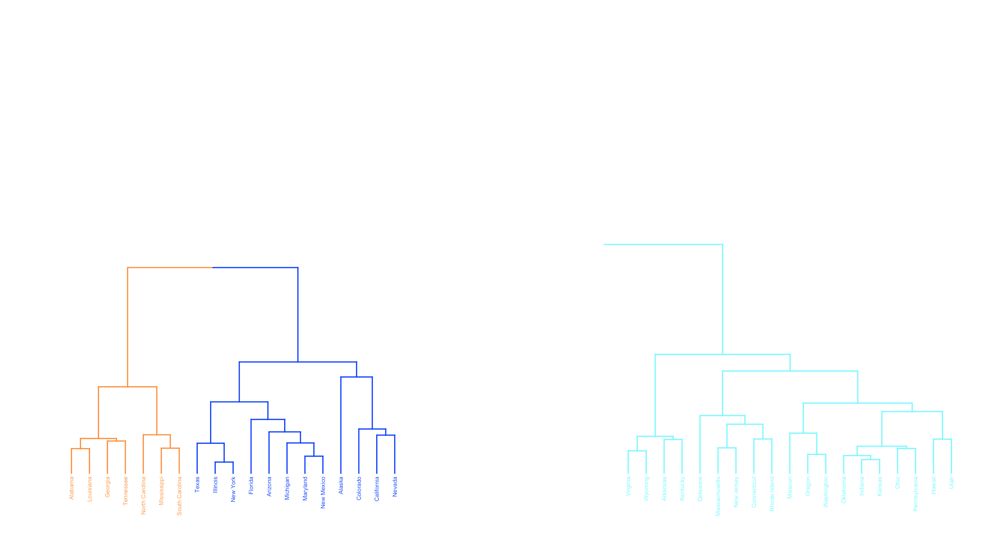
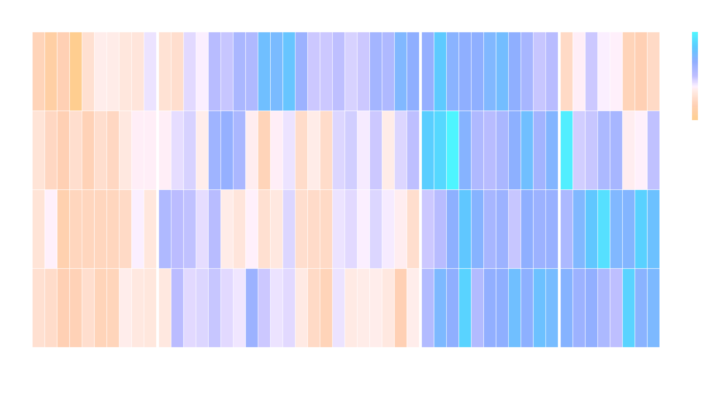
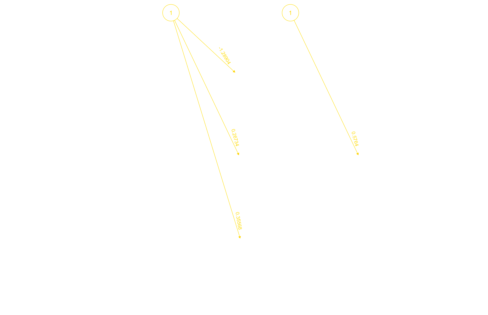
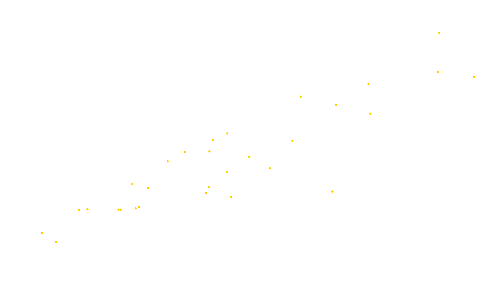
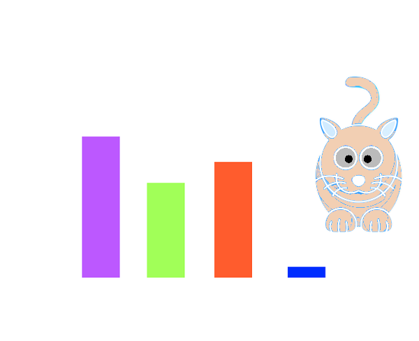

```{r setup, include = FALSE}
if (requireNamespace("thematic")) thematic::thematic_rmd(font = "auto")
if(!require("knitr")){ install.packages("knitr")}
library(knitr)
knitr::opts_chunk$set(
  comment = NA,
  error = FALSE,
  warning = FALSE,
  message = FALSE,
  class.source = "SCodeR",
  class.output = "OCodeR"
)
if(!require("pacman")){ install.packages("pacman")}
pacman::p_load(ourdata, reticulate, VennDiagram, htmltools, sqldf)
```

# R-Package `ourdata`

The **R package** `ourdata` was created for Data Science courses at the Fresenius University of Applied Sciences. It contains most of the **datasets** used for practice purposes, as well as some self-programmed **functions** with which this data can be manipulated and **plots** can be generated.

## Data `data`

The R package `ourdata` contains the following **data**:

- `fragebogen` 
  - Head circumference and other features from student surveys.
  - Age, gender, math grade, expected grade, fear, interest, practice 
- `hdi` 
  - Worldwide **Human Development Index**.
- `imr` 
  - **Infant mortality rates** worldwide.
- `kirche` 
  - **Church exits** in Germany from *2017* to *2020*.
- `koelsch` 
  - Consumption of **Cologne beer (Koelsch)** from *2017* to *2020*.
- `oecd_preventable` 
  - **OECD preventable mortality data** from *2010* onwards.
  - Standardized death rates per 100,000 inhabitants across OECD countries.

With the **function** `help()` you can display **help pages** for all *datasets*. E.g. `help(fragebogen)` explains the content of the data package `fragebogen`.

## Functions `functions`

The R package `ourdata` contains the following **functions**:

- `combine(x, y, ...)` 
  - Combines two datasets using **ID** and **foreign key matching**.
- `ourdata()`
  - Prints a **welcome message**.
- `plotter(...)` 
  - Draws various **plots** interactively with variable data.</li>
- `transformer(x, ...)` 
  - Transforms **values** of **type** *char* into *numeric values*,
  - e.g. `female` to `1`, `male` to `2` and `divers` to `3`.

With the **function** `help()` you can display **help pages** for all *functions*. E.g. `help(plotter)` explains the functionality of the function `plotter()`.

# Data Science Courses

In the Data Science courses at the Fresenius University of Applied Sciences, we have covered many topics of **data analysis** and examined some **technical applications** more closely. The focus was on **R**, a *statistical programming language*, which was also used to create this document.

Course materials include lecture slides as well as all *R scripts* and other materials. Here you will find **plots** and **statistical methods** and their *R code* presented in an appealing way. The code is waiting for you to try it out!

## Plots `plots` {.tabset .tabset-pills}

In **R** or **RStudio**, you can use various **plot types** for visualization. The **function** `plotter()` helps you create all plots (except the pie chart) with your own data.

```{r Abb2.1a, echo = FALSE, fig.cap = "Fig. 2.1a: Heatmap", out.width = '100%'}

```

Here is a selection of **plot types** with the corresponding **code**:
 
### Bar Plot

The **bar plot** illustrates the connection between a *numerical* and a *categorical* **variable**. The bar plot displays each **category** as a **bar** and reflects the corresponding *numerical* value with the **size** of the bar.

```{r Bar-Plot, fig.height=4, fig.showtext = TRUE, results = 'hold', class.source = ".foldable"}
# Creating bar plot
barplot(kirche$Austritte, kirche$Jahr, main = "Church Exits", col.main = "white", col.lab = "white", yaxt = "n", ylab = "Exits (per 1,000)", xlab = "Years", names = c("2017", "2018", "2019", "2020"))

# Improving labeling for x and y axis and adapt color scheme for dark theme
axis(1, at = 1:4, lwd = 3, lwd.ticks = 3, col = "white", col.ticks = "white", col.lab = "white", col.axis = "white")
ypos <- seq(0, 600000, by = 100000)
axis(2, at = ypos, labels = sprintf("%1.0f", ypos), lwd = 0.5, lwd.ticks = 1, col = "white", col.ticks = "white",  col.axis = "grey")
```

### Box Plot

The **box plot** shows the **distribution** of a *numerical* **variable** based on five summary statistics:
- minimum non-outlier
- first quartile
- median
- third quartile
- maximum non-outlier

Box plots also show the positioning of outliers and whether the data is skewed.

```{r Box-Plot, fig.height=4, fig.showtext = TRUE, results = 'hold'}
# Creating box plot
boxplot(koelsch$Koelsch, main = "Koelsch Consumption", col.main = "white", col.lab = "white", yaxt = "n", ylab = "Koelsch Consumption in Mil. Liters", xlab = "over the period 2017 to 2020", names = "2020")

# Improving labeling for y axis and adapt color scheme for dark theme
ypos <- seq(160000000, 200000000, by = 10000000)
axis(2, at = ypos, labels = sprintf("%1.0fM.", ypos/1000000), lwd = 0.5, lwd.ticks = 1, col = "white", col.ticks = "white",  col.axis = "grey")
```

### Density Plot

The **density plot** shows the distribution of a *numerical* **variable** over a **continuous interval**. *Peaks* of a density plot visualize where the values of *numerical* variables **concentrate**.

```{r Denstiy-Plot, fig.height=4, fig.showtext = TRUE, results = 'hold'}
# Creating density plot
plot(density(fragebogen$alter), main = "Age Distribution in Course", col.main = "white", col.lab = "white", yaxt = "n", ylab = "Persons (Density)", xlab = "Age (in years)")

# Improving labeling for y axis and adapt color scheme for dark theme
ypos <- c(0, 0.01, 0.02, 0.03, 0.04, 0.05, 0.06)
axis(2, at = ypos, labels = sprintf("%1.0fP", ypos*50), lwd = 0.5, lwd.ticks = 1, col = "white", col.ticks = "white",  col.axis = "grey")
```

### Heatmap

A **heatmap** visualizes individual values of a **matrix** with **colors**. **More frequent values** are typically displayed by *lighter reddish* colors and **less frequent** values are typically displayed by *darker* colors.

```{r Heatmap, fig.height=4, fig.showtext = TRUE}
data <- matrix(rnorm(81, 0, 9), nrow = 9, ncol = 9)     # Create example data
colnames(data) <- paste0("Column ", 1:9)                # Set column names
rownames(data) <- paste0("Row ", 1:9)                   # Set row names

# Creating heatmap
heatmap(data, main = "Heatmap", col.main = "white", col.lab = "white")
```

### Histogram

The **histogram** groups *continuous* **data** into ranges and displays this data as **bars**. The **height** of each bar shows the **number** of **observations** in each range.

```{r Histogram, fig.height=4, fig.showtext = TRUE, results = 'hold'}
# Creating histogram
hist(fragebogen$kopf, main = "Head Circumferences", col.main = "white", col.lab = "white", ylab = "Persons (Count)", xlab = "Head Circumference (in cm)")
```

### Line Plot

The **line plot** visualizes values along a **sequence** (e.g. *over time*). Line plots consist of an *x-axis* and a *y-axis*. The x-axis typically shows the **sequence** and the y-axis shows the values that **correspond** to each point in the sequence.

```{r Line-Plot, fig.height=4, fig.showtext = TRUE, results = 'hold'}
# Creating line plot
plot(fragebogen$note_mathe, type = "l", main = "Math Grades", ylab = "Grades", xlab = "Person x",  yaxt = "n", col.main = "white", col.lab = "white")

# Improving labeling for y axis and adapt color scheme for dark theme
ypos <- c(2, 3, 4, 5)
axis(2, at = ypos, labels = sprintf("%1.0f", ypos), lwd = 0.5, lwd.ticks = 1, col = "white", col.ticks = "white", col.lab = "grey", col.axis = "white")
```

### Pairs Plot

The **pairs plot** is a plot matrix that consists of **scatter plots** for each **variable combination** of a **data frame**.

```{r Pair-Diagram, fig.height=4, fig.showtext = TRUE, results = 'hold'}
# Creating pairs plot
pairs(data.frame(fragebogen$interesse, fragebogen$note_annahme), main = "Relationship Interest and Expected Grade", labels = c("Interest", "Expected Grade"), col.main = "white", col.lab = "white")
```

### Qqplot

A **QQplot** (or **Quantile-Quantile plot**) determines whether *two* **data sources** come from a **common distribution**. QQplots plot the **quantiles** of the two *numerical* data sources against each other. If both data sources come from the same distribution, the **points** fall on an **angle** of *45°*.


```{r Qqplot, fig.height=4, fig.showtext = TRUE, results = 'hold'}
# Creating qqplot
qqplot(fragebogen$geschlecht, fragebogen$note_mathe, main = "Gender and Math Grade", yaxt = "n", ylab = "Math Grade", xaxt = "n", xlab = "Gender (1 'female', 2 'male')", col.main = "white", col.lab = "white")

# Improving labeling for x and y axis and adapt color scheme for dark theme
xpos <- c(1, 2)
axis(1, at = xpos, labels = sprintf("%1.0f", xpos), lwd = 0.5, lwd.ticks = 1, col = "white", col.ticks = "white", col.lab = "grey", col.axis = "white")
ypos <- c(2, 3, 4 , 5)
axis(2, at = ypos, labels = sprintf("%1.0f", ypos), lwd = 0.5, lwd.ticks = 1, col = "white", col.ticks = "white", col.lab = "grey", col.axis = "white")
```

### Scatter Plot

The **scatter plot** displays two *numerical* **variables** with **points**. Each point shows the value of one variable on the *x-axis* and the value of the other variable on the *y-axis*.

```{r Scatter-Plot, fig.height=4, fig.showtext = TRUE}
# Combine data
df <- combine(imr$name, hdi$country, imr$value, hdi$hdi, col1 = "Country", col2 = "IMR", col3 = "HDI")

# Creating scatter plot
plot(df$HDI, df$IMR, main = "Influence of HDI on IMR", ylab = "IMR", xlab = "HDI", col.main = "white", col.lab = "white")
```

### Pie Chart

**Pie charts** are widely used, but have some disadvantages: 

- Differences between proportional values are less recognizable, since the area of the circle segments must be compared
- with many categories, the representation quickly becomes confusing
- very small proportional values often cannot be displayed in pie charts

Due to these **disadvantages**, the use of pie charts is only recommended in *rare cases*; usually **dot plots** or **bar plots** provide better representations.

```{r Pie-Diagram, fig.height=4, fig.showtext = TRUE, results = 'hold'}
# Creating labels with total and percentage
pie_labels <- paste0(kirche$Austritte, " (", round(100 * kirche$Austritte/sum(kirche$Austritte), 2), "%)")

# Creating pie chart
pie(kirche$Austritte, main = paste0("Church Exits per Year (total ", sum(kirche$Austritte), ")"), labels = pie_labels, col = c("white", "lightblue", "mistyrose", "brown"))

# Creating legend
legend("topleft", legend = c("2017", "2018", "2019", "2020"), fill =  c("white", "lightblue", "mistyrose", "brown"))
```

### Venn Diagram

A **Venn diagram** (or **set diagram**; **logic diagram**) illustrates all possible *logical* **relationships** between specific **data characteristics**. Each characteristic is represented as a **circle**, with *overlapping* parts of the circles representing **elements** that have both characteristics **simultaneously**.

```{r Venn-Diagram, fig.height=4, fig.showtext = TRUE, results = 'hide', echo = TRUE}
# Creating triple Venn diagram
draw.triple.venn(area1 = koelsch$Koelsch[4], area2 = kirche$Austritte[4], area3 = 1000000, n12 = 220000, n23 = 50000, n13 = 600000, n123 = 40000, main = "Koelsch -> Church Exit -> Cologne?", fill = c("yellow", "brown", "blue"), category = c("Koelsch", "Church", "Cologne"), main.col = "white", sub.col = "white", col = "white")
```

## Data Mining `data science` {.tabset .tabset-pills}

The **methods** of **data mining** can basically be divided into the groups *classification*, *prediction*, *segmentation* and *dependency discovery*. **Algorithms** are used for this purpose. 

*An algorithm is a formal instruction for solving instances of a specific problem class.* ^[Sauer [2019]]

```{r Abb2.2a, echo = FALSE, fig.cap = "Fig. 2.2a: Data Mining Groups", out.width = '50%'}

```

Here you will find the **data mining methods** from the lectures, with the corresponding **code**:

### Correlation Analysis

If you want to investigate a **relationship** between two **metric variables**, for example between the age and weight of children, you calculate a **correlation**. This consists of a **correlation coefficient** (`rho` for Spearman) and a **p-value**.

The **correlation coefficient** indicates the strength and direction of the relationship. It ranges between `-1` and `1`. A value near `-1` indicates a strong **negative relationship** (e.g. *"More distance traveled by car, less fuel in the tank"*). A value near `1` indicates a strong **positive relationship** (e.g. *"more feed, fatter cows"*). No relationship exists when the value is close to `0`. 

The **p-value** indicates whether there is a **significant relationship**. **p-values** less than `0.05` are considered **statistically significant**.

```{r Korrelationsanalyse, fig.height=4, fig.showtext = TRUE, results = 'hold'}
# Combining both lists with 'SQL JOIN'
imr_hdi <- sqldf('SELECT imr.name AS "country", imr.value As "imr", hdi.hdi AS "hdi" FROM imr INNER JOIN hdi ON imr.name = hdi.country ORDER BY imr.value DESC')

# Scatter plot
plot(imr_hdi$imr ~ imr_hdi$hdi, main = "HDI IMR Correlation", ylab = "Infant Mortality (per 1,000)", xlab = "Human Development Index", xlim = range(0:1), ylim = range(1:110))

# Quantify relationships using Spearman correlation function
cor.test(imr_hdi$imr, imr_hdi$hdi, method="spearman", exact=FALSE)
```

### Linear Regression Analysis

**Linear regression** is one of the most useful tools in statistics. Regression analysis allows you to estimate **relationships** between parameters and thus provide an explanatory model for the occurrence of certain phenomena. True causality is not revealed by statistical analyses of this kind, but the results from such analyses can provide clues in this direction. ^[Wozabal [2007]]

```{r LinearRegressAnalyse, fig.height=4, fig.showtext = TRUE, results = 'hold'}
# Creating a comparable dataset with IMR and HDI using the 'combine' function from the R package 'ourdata'
df <- combine(imr$name, hdi$country, imr$value, hdi$hdi, col1 = "Country", col2 = "IMR", col3 = "HDI")

# Creating linear model with 'lm'
mdl <- lm(IMR ~ HDI, data=df)

# Showing model's summary
summary(mdl)

# Calculating the p-value for 'HDI'
matCoef <- summary(mdl)$coefficients
pval <- matCoef["HDI", 4]
print(paste0("The effect of HDI on IMR is statistically significant p = ", round(pval, 2), " (", pval, ")."))

# Creating plot
plot(df$HDI, df$IMR, xlab = "Predictor", ylab = "Result", col = "darkblue", pch = 16, main = "Linear Regression")

# Creating regression line
abline(mdl, col = "darkred")
```

### Market Basket Analysis

**Market basket analysis** can lead to the discovery of **associations** and **correlations** between elements in huge transactional or relational datasets.

Finding **connections** between different items that customers put in their "shopping baskets" is a common application of the analysis. Knowledge of these associations can be helpful for retailers or marketers to develop marketing strategies. This happens by gaining insights into which items are frequently purchased together by customers.

For example, if customers buy milk, *how likely is it that they will also buy bread (and which type of bread) on the same trip to the supermarket?* This information can lead to increased sales by helping retailers engage in **selective marketing** and plan their sales floor.

```{r BasketAnalyse, fig.height=4, fig.showtext = TRUE, echo = TRUE}
# Loading libraries
library(arules)     # Package with mining datasets and association rules
library(datasets)   # OpenIntro datasets

# Loading data frame
data(Groceries)

# Creating frequency plot for the top 20 items
itemFrequencyPlot(Groceries, topN = 20, type = "absolute", horiz = TRUE)

# Searching for milk
itemFrequency(Groceries)[grep("milk", itemLabels(Groceries))]

# Deriving the rules
rules <- apriori(Groceries, parameter = list(supp = 0.001, conf = 0.8))

# Showing the top 5 rules (only 2 decimal places)
options(digits=2)
inspect(rules[1:5])
rules <- sort(rules, by="confidence", decreasing = TRUE)
rules <- apriori(Groceries, parameter = list(supp = 0.001, conf = 0.8, maxlen = 10))
```
```{r BasketAnalyse2, fig.height=4, fig.showtext = TRUE, results = 'hold', echo = TRUE,  eval = FALSE}
# Loading package with visualization association rules
library(arulesViz)

# Matrix calculations
subset.matrix <- is.subset(rules, rules)
subset.matrix[lower.tri(subset.matrix, diag = T)] <- NA
redundant <- colSums(subset.matrix, na.rm = T) >= 1

# Output plot
plot(rules, method = "graph", engine = "htmlwidget")
```
```{r showHTML, echo = FALSE, fig.cap = "Fig. 2.2.3a: Basket Analysis"}
htmltools::includeHTML("basket_analysis.html")
```

### Cluster Analysis K-Means

**K-Means** is a **clustering method** in which the **datasets** are divided into a series of `k` groups, where `k` is the number of groups specified by the analyst.

The following *R codes* show how to determine the optimal number of clusters and how to compute K-Means and PAM clustering in R.

Determining the **optimal number of clusters**:

```{r K-Means, fig.height=4, fig.showtext = TRUE, echo = TRUE, error = FALSE, warning = FALSE, eval = FALSE}
# Loading libraries
library(cluster)
library(factoextra)
library(pheatmap)

# Creating dataset of crime in the USA
mydata <- scale(USArrests) 

# K-Means Clustering
fviz_nbclust(mydata, kmeans, method = "gap_stat")
```
```{r Abb2.2.4a, echo = FALSE, fig.cap = "Fig. 2.2.4a: Optimal Number of Clusters", out.width = '100%'}

```

Computing and visualizing the **K-Means Cluster**:

```{r K-Means2, fig.height=4, fig.showtext = TRUE, echo = TRUE, error = FALSE, warning = FALSE, eval = FALSE}
set.seed(123) # for reproducibility
km.res <- kmeans(mydata, 3, nstart = 25)

# Visualizing K-Means clusters
fviz_cluster(km.res, data = mydata, palette = "jco", ggtheme = theme_minimal(), barfill = "red", barcolor	= "red", linecolor = "red")
```
```{r Abb2.2.4b, echo = FALSE, fig.cap = "Fig. 2.2.4b: Cluster", out.width = '100%'}

```

**Hierarchical clustering** is an alternative approach to **partitioning clustering** to identify groups in a dataset. In this method, the number of clusters to be generated does not need to be specified in advance.

The result of hierarchical clustering is a *tree-like* representation of the objects, which is also called a **dendrogram**. Observations can be divided into groups by cutting the dendrogram at a desired **similarity level**:

```{r K-Means3, fig.height=4, fig.showtext = TRUE, echo = TRUE, error = FALSE, warning = FALSE, eval = FALSE}
# Hierarchical clustering
# Cluster dendrogram
res.hc <- hclust(dist(mydata),  method = "ward.D2")
fviz_dend(res.hc, cex = 0.5, k = 4, palette = "jco")
```
```{r Abb2.2.4c, echo = FALSE, fig.cap = "Fig. 2.2.4c: Cluster Dendrogram", out.width = '100%'}

```

A **heatmap** is another way to visualize hierarchical clustering. It is also called a **false color image**, where data values are converted to a color scale. With heatmaps, we can simultaneously visualize groups of samples and features:

```{r K-Means4, fig.height=4, fig.showtext = TRUE, echo = TRUE, error = FALSE, warning = FALSE, eval = FALSE}
# Creating heatmap
pheatmap(t(mydata), cutree_cols = 4)
```

```{r Abb2.2.4d, echo = FALSE, fig.cap = "Fig. 2.2.4d: Cluster Heatmap", out.width = '100%'}

```

### Neuronale Netze-Analyse

A **neural network** is an information processing machine and can be considered an analog to the **human nervous system**. Just like the human nervous system, which consists of interconnected neurons, a neural network is composed of interconnected **information processing units**. The information processing units do not work in a *linear* way. Rather, the neural network derives its strength from the *parallel* processing of information, which enables it to deal with **nonlinearity**. Neural networks are useful for deriving meaning from complex datasets and recognizing patterns.

Here the **neural network** is visualized. Our model has **3 neurons** in its hidden layer. The black lines show the connections with the weights. The weights are calculated using the backpropagation algorithm explained earlier. The yellow lines represent the bias term:

```{r NeuronaleNetze-Analyse, fig.height=4, fig.showtext = TRUE, echo = TRUE, eval = FALSE}
# Loading 'neuralnet' library
library(neuralnet)

# Reading data
data <- read.csv("cereals.csv", header=T)

# Random sampling
samplesize = 0.60 * nrow(data)
set.seed(80)
index <- sample( seq_len ( nrow ( data ) ), size = samplesize )

# Creating training and test datasets
datatrain <- data[ index, ]
datatest <- data[ -index, ]

# Scaling data for neural network
max <- apply(data , 2 , max)
min <- apply(data, 2 , min)
scaled <- as.data.frame(scale(data, center = min, scale = max - min))

## Fitting neural network
# Creating training and test datasets
trainNN <- scaled[index , ]
testNN <- scaled[-index , ]

# Fitting neural network
set.seed(2)
NN <- neuralnet(rating ~ calories + protein + fat + sodium + fiber, trainNN, hidden = 3 , linear.output = T )

# Creating plot
plot(NN)
```

```{r Abb2.2.5a, echo = FALSE, fig.cap = "Fig. 2.2.5a: Neural Network", out.width = '100%'}

```

Here the model rating is predicted using the **neural network model**. The predicted rating can be compared with the real rating through visualization. The RMSE for the neural network model is 6.05:

```{r NeuronaleNetze-Analyse2, fig.height=4, fig.showtext = TRUE, echo = TRUE, eval = FALSE}
## Prediction using the neural network
predict_testNN <- compute(NN, testNN[,c(1:5)])
predict_testNN <- (predict_testNN$net.result * (max(data$rating) - min(data$rating))) + min(data$rating)

# Creating plot and regression line
plot(datatest$rating, predict_testNN, col='blue', pch=16, ylab = "predicted rating NN", xlab = "real rating")
abline(0,1)
```
```{r Abb2.2.5b, echo = FALSE, fig.cap = "Fig. 2.2.5b: Neural Network", out.width = '100%'}

```

## Miscellaneous `misc` {.tabset .tabset-pills}

Here you will find **code examples**, **fun stuff** and **news** about *technical applications & data analysis*:

### Example R Code

This example shows the use of **loops** in R. Loops are frequently used in **programming**, e.g. to check **matches** in two different datasets.

```{r RloopCode, code = readLines(system.file("extdata", "Komplexeres_R_Skript.R", package = "ourdata", mustWork = FALSE))}
```

### Execute External R Code

This **code** is in the file `example.R` and is read and executed by **R Markdown**.

```{r ExtCode, echo = FALSE, fig.height=4, fig.showtext = TRUE, results = 'hold'}
read_chunk(system.file("extdata", "example.R", package = "ourdata", mustWork = FALSE))
```

```{r variablesXY}
```

```{r plotXY}
```

### Cat Statistics

1000 **scientists** have found out completely *independently* from each other (in compliance with all scientific requirements):

```{r Abb2.3.7a, echo = FALSE, fig.cap = "Fig. 2.3.7a: Cat Statistics", out.width = '100%'}

```

### Big Data Jobs

An [interesting article](https://www.thebalancecareers.com/top-7-big-data-jobs-4588947) (*if no longer available - click on the article*) that identifies jobs in the **Big Data** field and lists possible **salaries** (in dollars):

```{r showPDF, echo = FALSE, fig.cap = "Fig. 2.3.8a: Big Data Jobs"}
htmltools::includeHTML("pdf.html")
```

### Serious Ben Entertainment

Here is my [**Serious Ben Entertainment**](https://www.seriousbenentertainment.org) website for eHealth services which I created during my studies at **University of Edinburgh** in the **Data Science for Health and Social Care (M. Sc.)** program:

```{r showBenBox.org, echo = FALSE, fig.cap = "Fig. 2.3.9a: Serious Ben Entertainment Website"}
htmltools::includeHTML("index.html")
```

# References `lit.` {.tabset .unnumbered}

Here is the **literature** used in Data Science courses:
<br /><br />
<ul>
<li>Cleve, J/Lämmel, U. [2020]<br />
*Data Mining*, 3. Auflage, Berlin/Boston 2020</li>
<br />
<li>Romeijn, J. W. [2016]<br />
*Philosophy of Statistics.* In E. N. Zalta (Hrsg.), The Stanford Encyclopedia of Philosophy, Stanford 2016</li>
<br />
<li>Sauer, S. [2019]<br />
*Moderne Datenanalyse mit R*, Wiesbaden 2019</li>
<br />
<li>Tukey, J. W. [1962]<br />
*The future of data analysis. The Annals of Mathematical Statistics*, Vol. 33, No. 1, Institute of Mathematical Statistics 1962</li>
<br />
<li>Wickham, H./Garrett G. [2017]<br />
*R for Data Science*, O‘Reilly Media 2017</li>
<br />
<li>Wozabal, D. [2007]<br />
*Statistisches Programmieren – Regressionen in R (Session 6)*, 2007</li>
</ul>
